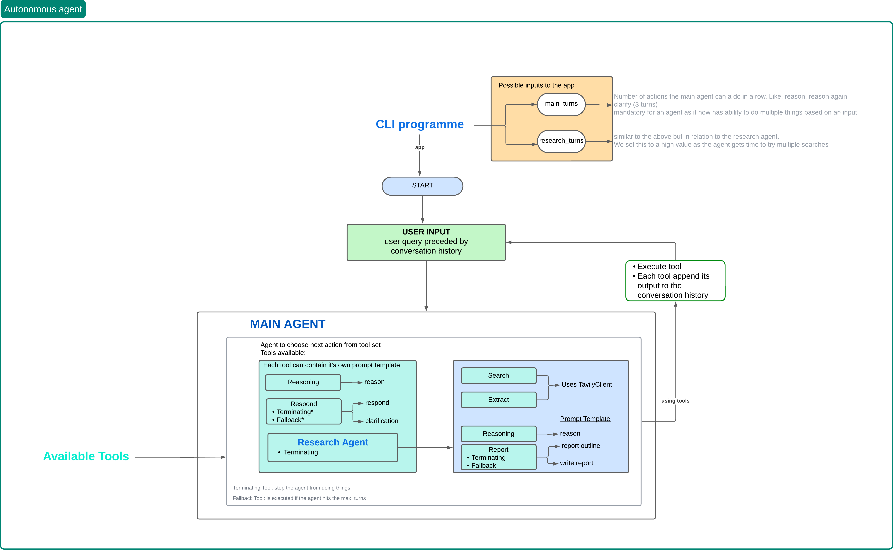

Here’s a README for your new codebase, following the structure of the example you provided:

---

# AI-Powered Conversational Agent

[](https://meg-patakota.github.io)
[](https://meg-patakota.github.io)
[](https://github.com/yourusername/autonomous_market_research_agent)

> ⚠️ **Disclaimer:** This project is a work in progress. Features, documentation, and code structure may evolve.

## Table of Contents
- [Overview](#overview)
- [Installation](#installation)
- [Next Steps](#next-steps)
- [Contributing](#contributing)

---

## Overview

This project is an **AI-powered conversational agent** that utilizes advanced reasoning, search capabilities, and structured response generation to interact with users dynamically. The core functionalities include:

---

## Installation

### Prerequisites
- Python 3.10+
- Poetry (for dependency management)
- OPENAI_API_KEY
- TAVILY_API_KEY
    - Go to the [Tavily website](https://docs.tavily.com/api-reference/introduction)
    - Click on 'Get an API Key'

### Setup

```bash
# Clone the repository
git clone https://github.com/yourusername/autonomous_market_research_agent.git
cd autonomous_market_research_agent

# Install dependencies
poetry install

# Run the app
export OPENAI_API_KEY="your-api-key-here"
export TAVILY_API_KEY="your-tavily-api-key-here"
poetry run python run app.py
```

---



---

## Contributing

1. Fork the repository.
2. Open an issue for discussion.
3. Submit a Pull Request with clear descriptions.

For further discussions or feedback, reach out via [GitHub](https://meg-patakota.github.io).

---

## License

This project is maintained by **Meg Patakota**. Not licensed for redistribution without explicit permission.

---
